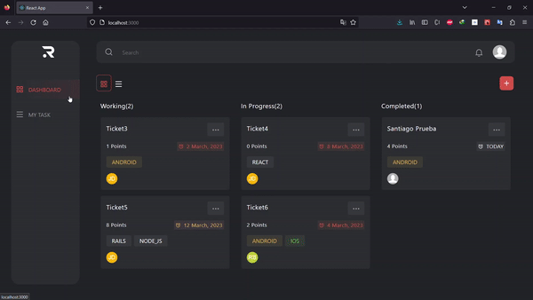
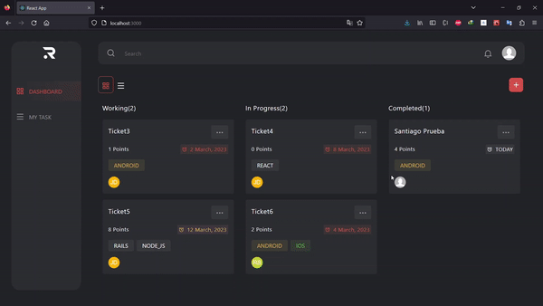
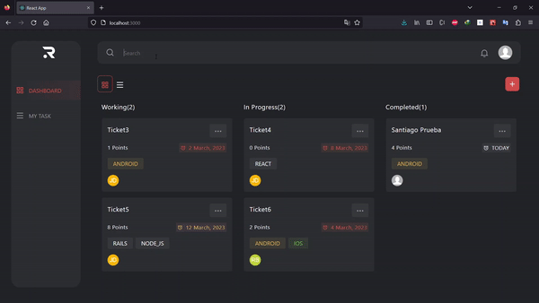
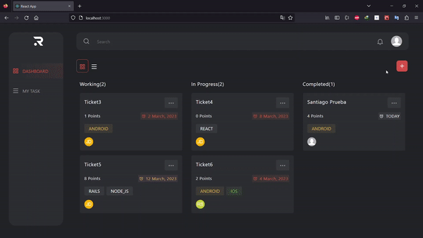
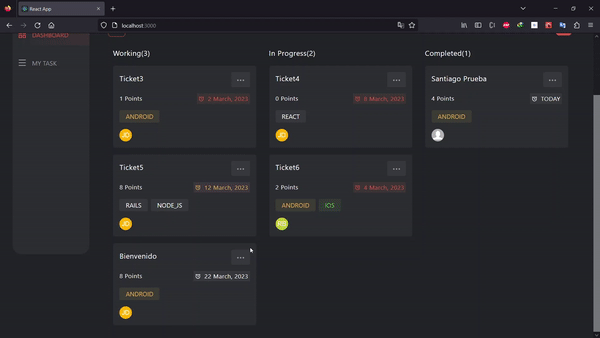

# Ravn-challenge

This project was bootstrapped with [Create React App](https://github.com/facebook/create-react-app).

## About challenge Ravn

The challenge is to create a task management application that allows adding and browsing tasks for users, using a provided API with all the necessary information. The goal is to demonstrate skills in writing clean software, clear communication, and following instructions.

## Installation

### Create a .env file
In the file you add the next line and put your token :

``` 
REACT_APP_API_KEY ="TOKEN"
 ```
### Version Node v14.15.4

### Install Application
``` 
npm install
 ```

### Run Application
``` 
npm start
 ```

## Views of Page
### Page Navigation



### Page Responsive


### Page Search



### Add a new task



### Delete task


## Technologies/libraries used

- **"@apollo/client": "^3.7.10"**
- **"@testing-library/jest-dom": "^5.16.5"**
- **"@testing-library/react": "^13.4.0"**
- **"@testing-library/user-event": "^13.5.0"**
- **"apollo-boost": "^0.4.9"**
- **"bootstrap": "^5.2.3"**
- **"graphql": "^16.6.0"**
- **"moment": "^2.29.4"**
- **"multiselect-react-dropdown": "^2.0.25"**
- **"react": "^18.2.0"**
- **"react-apollo": "^3.1.5"**
- **"react-bootstrap": "^2.7.2"**
- **"react-dom": "^18.2.0"**
- **"react-router-dom": "^6.8.2"**
- **"react-scripts": "5.0.1"**
- **"styled-components": "^5.3.8"**
- **"web-vitals": "^2.1.4"**